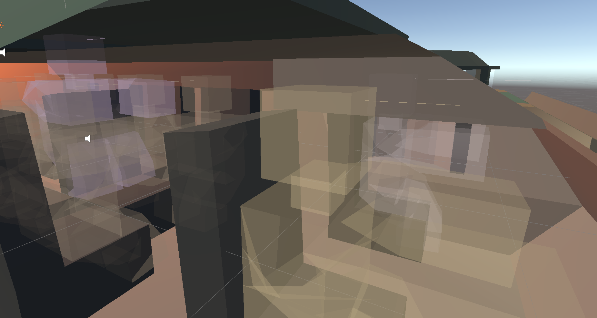
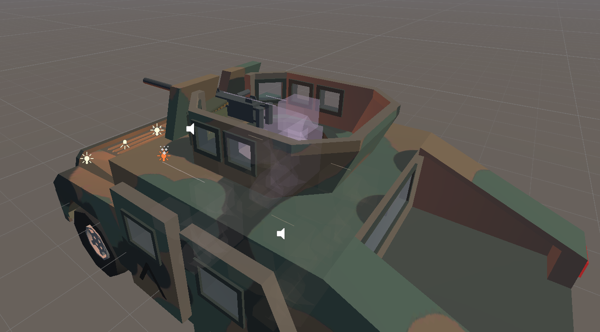
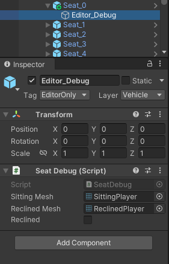
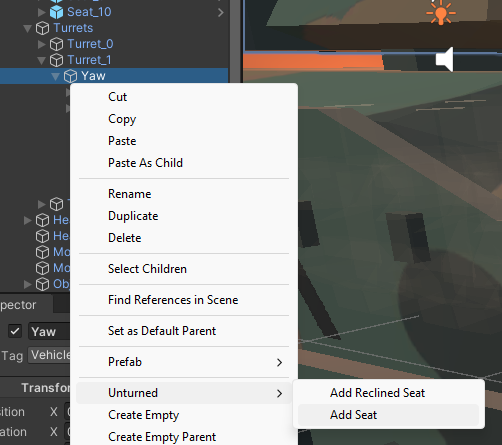
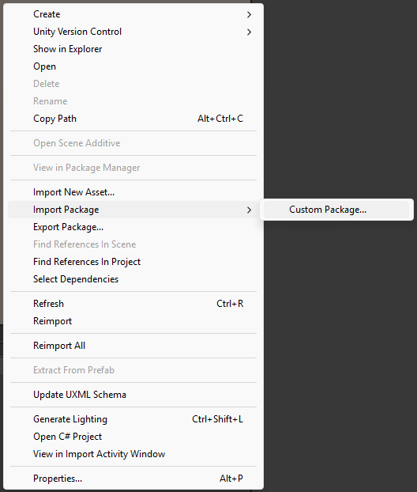

# SeatDebug
Unity package that shows a very close estimation on how players will look in Unturned that attaches to the Seat objects.

The gizmo component is attached to an object tagged with the `EditorOnly` tag so it doesn't build to the bundle (which would otherwise cause warnings).

# Features
* Support for extra turret seats.
* Line showing player's eye level.
* Line showing turret aim.
* Colors indicate different properties.
  * Light Brown: Standard Seat
  * Very light pink: Driver
  * Yellow: Turret operator without a turret seat
  * Purple: Turret operator with a turret seat. In this case the player is rendered at the turret seat, not at the standard seat (which Unturned still requires to exist).

# How to use
Right click either the root of a vehicle or the `Yaw` or `Pitch` objects of a turret to add a seat to a vehicle. You can also right click on an existing seat object to replace it with the version with the debug script.

Navigate to **Unturned** -> **Add Seat** (or **Add Reclined Seat**)

# Installation
Download the [.unitypackage](https://github.com/DanielWillett/unturned-modding-notes/blob/main/SeatDebug.unitypackage) and import it into Unity.

That's it.